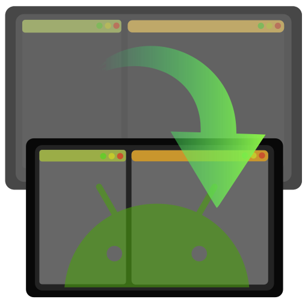

# WBeam

WBeam turns an Android phone/tablet into a USB-connected second screen for Linux.



## Current Status

`Wayland`:
- recommended path
- works end-to-end on current hosts
- best stability right now

`X11`:
- prototype path (`proto_x11/`)
- not feature-parity with Wayland
- for NVIDIA hosts, true second-monitor flow currently needs a hardware dummy plug

## What Works

- host daemon + control API (`/v1/status`, `/v1/start`, `/v1/stop`)
- Android app deploy and connect flow over USB/ADB
- version/build compatibility checks
- runtime diagnostics and logs
- desktop control tooling

## What Is Experimental

- full X11 virtual monitor flow (`proto_x11`)
- mixed GPU topologies (NVIDIA + EVDI on X11)
- fallback monitor-object path on X11

## Recommended Path

If you just want it to work now:
1. use `Wayland`
2. run main tooling (`./wbeam`, `./wbgui`)
3. treat `proto_x11` as R&D, not default runtime

## Quick Start

```bash
./wbeam --help
./wbeam service install
./wbeam service start
./wbeam android deploy-all
./wbgui
```

## X11 Prototype Notes

- entrypoint: `./proto_x11/run`
- policy is file-based: `~/.config/wbeam/x11-virtual-policy.conf`
- if preflight reports `xrandr-safe-topology`, the unsafe provider-link path is blocked by design
- this block prevents known Xorg crashes on NVIDIA+EVDI setups

## Repo Layout

- `android/` - Android client (`com.wbeam`)
- `src/host/rust/` - Rust daemon, core, streamer
- `src/apps/desktop-tauri/frontend` - desktop UI frontend
- `src/apps/desktop-tauri/backend` - desktop UI backend (Tauri)
- `src/apps/trainer-tauri/frontend` - trainer UI frontend
- `src/apps/trainer-tauri/backend` - trainer UI backend (Tauri)
- `src/host/scripts/` - host runtime scripts
- `proto/` - historical sandbox lane
- `proto_x11/` - X11 virtual-monitor prototype lane

For contributor-facing path conventions and migration targets, see:

- `docs/repo-structure.md`
- `docs/repo-structure-contract.md`

## Main Entrypoints

- `./wbeam` - canonical CLI
- `./wbgui` - terminal UI wrapper
- `./devtool` - developer helper
- `./start-remote` - remote session bootstrap
