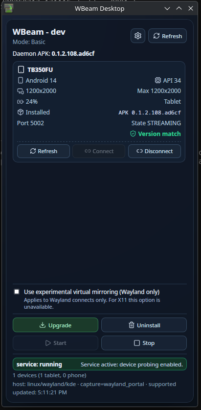

# WBeam

**Turn your Android phone or tablet into a wireless external display for Linux.**

WBeam enables high-performance streaming from a Linux host to Android devices over USB/ADB, providing a second screen with minimal latency and maximum quality. Perfect for productivity, streaming, or extending your workspace.



---

## Overview

WBeam has two main components working in concert:

| Component | Role | Details |
|-----------|------|---------|
| **Host (Linux)** | Server & capture | Daemon + desktop control app, manages display capture and streaming |
| **Android Client** | Display sink | APK running on phone/tablet, receives and displays video stream |

Data flows over USB via ADB, requiring no network configuration or wireless setup.

> [!TIP]
> **Current best practice:**
> - **EVDI capture backend** is the recommended path, providing ~60 FPS with low latency
> - **Wayland portal** fallback available, though less stable on some desktop configurations
> - For optimal results, ensure EVDI module is loaded: `sudo modprobe evdi`

---

## Getting Started (5-10 minutes)

### Prerequisites
- Linux host with USB port
- Android phone or tablet (API 17+)
- USB cable for ADB connection
- EVDI capture backend installed (see below)

### Quick Start

1. **Clone repository and enter directory:**
   ```bash
   git clone <repo> && cd WBeam
   ```

2. **Connect Android device via USB:**
   - Ensure ADB shows device in `device` state: `adb devices`
   - Enable USB debugging in Android settings if needed

3. **Build and deploy everything:**
   ```bash
   ./redeploy-local
   ```
   This automatically:
   - Builds host daemon and desktop UI
   - Compiles and installs Android APK
   - Verifies version compatibility
   - Launches desktop control application

4. **Start the service (if not already running):**
   ```bash
   ./wbeam service install
   ./wbeam service start
   ```

5. **Connect in desktop UI:**
   - Click **Connect** button in the WBeam desktop application
   - Observe video stream appearing on Android device

6. **Verify EVDI capture:**
   ```bash
   sudo modprobe evdi initial_device_count=1
   ```

### Troubleshooting EVDI

If EVDI isn't working, use the diagnostic tool:

```bash
bash scripts/evdi-diagnose.sh
```

For automated setup across any major Linux distribution (Arch, Debian, Ubuntu, Fedora, RHEL):

```bash
sudo bash scripts/evdi-setup.sh
```

See `EVDI_SETUP_INDEX.md` and `docs/EVDI_SETUP_GUIDE.md` for complete troubleshooting guidance.

### Android Debug Menu

To access debug options in the APK:
- Hold **VOL+** and **VOL-** buttons simultaneously for ~2 seconds
- Debug menu appears with streaming diagnostics and settings

---

## Common Commands Reference

| Command | Purpose |
|---------|---------|
| `./wbeam --help` | Show all available commands |
| `./wbeam host build` | Build host daemon and streamer |
| `./wbeam android deploy-all` | Build and deploy APK to all connected devices |
| `./desktop.sh` | Launch desktop control application |
| `./redeploy-local` | Full rebuild + deploy + launch (recommended for development) |
| `./wbeam service install` | Install systemd service (user-level) |
| `./wbeam service start` | Start the daemon service |
| `./wbeam service status` | Check if daemon is running |
| `./wbgui` | Terminal UI wrapper around core workflows |
| `./devtool` | Developer convenience wrapper |

### Quick Reference

For a complete development workflow:
```bash
# One-command full setup (build, deploy, run)
./redeploy-local

# If desktop closes, restart it
./desktop.sh

# Manual service control
./wbeam service install && ./wbeam service start

# Check EVDI is loaded
sudo modprobe evdi initial_device_count=1
```

---

## Performance Tuning with Trainer (Autotune)

WBeam includes an interactive tuner to benchmark different encoding profiles and automatically generate optimized configurations for your specific hardware and network conditions.

### Quick Start with Trainer

```bash
./wbeam host tuner
```

This launches an interactive GUI where you can:

### Configuration Options

| Setting | Purpose | Default |
|---------|---------|---------|
| **Objective** | What to optimize for | FPS (frames per second) |
| **Workload** | Scene complexity to test | Mixed (varies) |
| **Training Mode** | Prerendered scenes vs. virtual desktop | Prerendered (deterministic) |
| **Child Train Time** | Seconds per test run | 5s |

### Training Modes Explained

- **Prerendered scenes** (recommended)
  - Uses deterministic synthetic test scenes
  - Consistent, reproducible results
  - No compositor overhead
  - Useful for maximum frame rate tuning (>60 FPS)

- **Virtual desktop mode**
  - Captures from your live desktop
  - Real-world testing
  - Limited by Wayland/X11 compositor cap (~60 FPS on many systems)

### Generated Profiles

After training completes, the tuner displays:
- Final score and performance metrics
- Winning bitrate/FPS/intra-frame settings
- Details about the run configuration

Profiles are automatically saved to:
```
~/.config/wbeam/trained_profiles.json
```

Example trained profiles are available in:
```
config/trainer-profiles/examples/
```

---

## Repository Structure

The repository is organized by domain boundaries:

```
WBeam/
├── android/         # Android client (APK source code)
├── host/           # Linux host daemon and streamer
├── desktop/        # Desktop UI applications
├── shared/         # Shared protocol and contracts
├── scripts/        # Utility and setup scripts
├── config/         # Configuration templates and profiles
├── docs/           # Documentation and guides
└── logs/           # Runtime logs and diagnostics
```

### Key Documentation

- **`docs/repo-structure.md`** - Detailed repository layout and module organization
- **`docs/EVDI_SETUP_GUIDE.md`** - Complete EVDI installation and troubleshooting
- **`EVDI_SETUP_INDEX.md`** - EVDI quick reference and support matrix
- **`docs/agents.workflow.md`** - Development workflow and best practices

---

## Main Entrypoints

| Tool | Purpose | Usage |
|------|---------|-------|
| `./wbeam` | **Main CLI** - all operations | `./wbeam --help` |
| `./wbgui` | Terminal UI wrapper | Interactive menu-driven interface |
| `./devtool` | Developer convenience | Common dev tasks shortcut |
| `./desktop.sh` | Launch desktop app | Desktop control UI |
| `./trainer.sh` | Launch trainer GUI | Interactive performance tuner |
| `./start-remote` | Remote setup & bootstrap | Remote host initialization |
| `./runas-remote` | Remote command execution | Run commands in active session |

---

## Capture Backends

WBeam supports multiple capture methods to match your desktop environment:

### EVDI (Recommended)

- **Platform:** Linux with kernel module support
- **Performance:** ~60 FPS, low latency, high quality
- **Setup:** `sudo bash scripts/evdi-setup.sh`
- **Use:** Explicitly specify via `?capture_backend=evdi` parameter
- **Advantages:** Direct kernel capture, bypasses compositor, best quality

### Wayland Portal

- **Platform:** Wayland sessions (GNOME, KDE, etc.)
- **Performance:** ~30-60 FPS (depends on compositor)
- **Fallback:** Automatic if EVDI unavailable
- **Limitations:** May be less stable on some configurations

### X11 Server

- **Platform:** X11 sessions
- **Performance:** Variable based on system load
- **Note:** Slower than Wayland portal in most cases

---

## Supported Devices

| Requirement | Min Version | Notes |
|------------|-------------|-------|
| **Android** | API 17 (4.2) | Supports legacy devices |
| **Linux** | Kernel 5.10+ | For EVDI support |
| **USB** | USB 2.0+ | ADB over USB required |

---

## Performance Tips

### For Best Quality

1. **Use EVDI capture:** Provides native resolution and 120 FPS capability
2. **Configure adaptive quality:** Let WBeam adjust bitrate based on network
3. **Use prerendered scenes for tuning:** More consistent profile generation
4. **Monitor bandwidth:** Adjust target bitrate to match your USB link speed

### For Lower Latency

1. **Reduce resolution on Android:** Lower resolution = less network traffic
2. **Increase frame rate:** WBeam adapts encode quality to maintain FPS
3. **Use EVDI backend:** Eliminates compositor delay
4. **Check USB cable quality:** Loose connections cause lag

### For Mobile Devices

1. **Reduce resolution:** Better battery life and thermal performance
2. **Lower frame rate:** Battery consumption scales with FPS
3. **Use adaptive profile:** Automatically balances quality vs. power

---

## Troubleshooting

### Stream won't connect

1. Verify ADB sees device: `adb devices`
2. Check service is running: `./wbeam service status`
3. Look at logs: `tail -f logs/*.log`
4. Verify APK version matches host: `./wbeam version doctor`

### EVDI not working

```bash
# Diagnose
bash scripts/evdi-diagnose.sh --verbose

# Automated setup
sudo bash scripts/evdi-setup.sh

# Manual load
sudo modprobe evdi initial_device_count=1
```

### Low frame rate or stuttering

1. Try EVDI backend: `?capture_backend=evdi`
2. Run adaptive tuning: `./wbeam host tuner`
3. Monitor bandwidth: Check USB connection quality
4. Verify CPU load: Both host and device should have headroom

### Desktop UI issues on Wayland

```bash
# Use Wayland-aware launcher
./desktop.sh

# Or use xwayland wrapper if needed
XDG_SESSION_TYPE=x11 ./desktop.sh
```

---

## Architecture Overview

```
┌─────────────────────────────────────────────────────────────┐
│                    Linux Host                               │
├─────────────────────────────────────────────────────────────┤
│                                                              │
│  ┌─────────────────┐           ┌──────────────────┐        │
│  │  Display Capture│           │  WBeam Daemon    │        │
│  │  (EVDI/Wayland) │──────────▶│  • Stream Mgmt   │        │
│  └─────────────────┘           │  • Encoding      │        │
│                                │  • Network Ctrl  │        │
│  ┌─────────────────┐           └──────────────────┘        │
│  │  Desktop UI     │                    │                   │
│  │  (Tauri App)    │◀───────────────────┼───────┐          │
│  └─────────────────┘                    │       │          │
│                                         │       │          │
│                                    ADB over USB  │          │
│                                         │       │          │
│                                         ▼       ▼          │
└─────────────────────────────────────────────────────────────┘
                                          │
                        ┌─────────────────┴──────────────────┐
                        │                                    │
                   ┌────▼────────────┐            ┌──────────▼────┐
                   │   Android Tablet│            │  Android Phone│
                   ├─────────────────┤            ├───────────────┤
                   │ • H.264/H.265   │            │ • H.264/H.265 │
                   │ • Display Sink  │            │ • Display Sink │
                   │ • Telemetry     │            │ • Telemetry   │
                   └─────────────────┘            └───────────────┘
```

---

## Development

For development workflow details, see:
- `docs/agents.workflow.md` - Team workflow and PR process
- `docs/repo-structure.md` - Detailed codebase organization
- `EVDI_SETUP_INDEX.md` - Setup troubleshooting guide

Quick dev setup:
```bash
git clone <repo> && cd WBeam
./redeploy-local  # One-command setup
./wbgui          # Use terminal UI for common tasks
```

---

## Contributing

WBeam is under active development. See workflow documentation for:
- Issue/branch naming conventions
- PR review process
- Commit message format
- Testing requirements

---

## License

See LICENSE file in repository root.

---

**Last Updated:** March 2026  
**Status:** Production Ready  
**Supported Platforms:** Linux (Arch, Debian, Ubuntu, Fedora, RHEL), Android 4.2+
